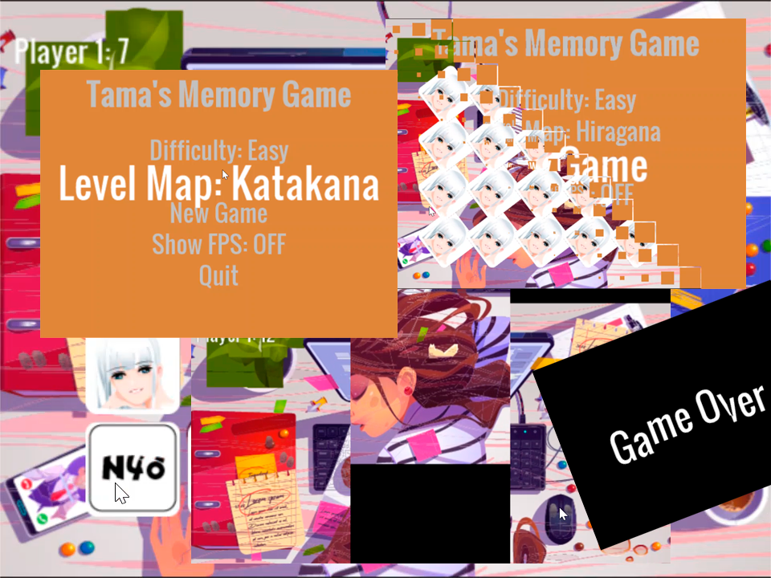
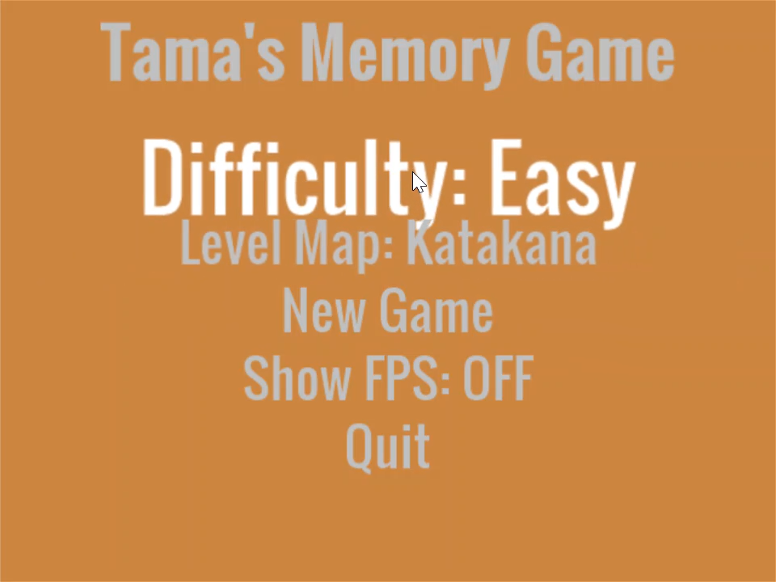
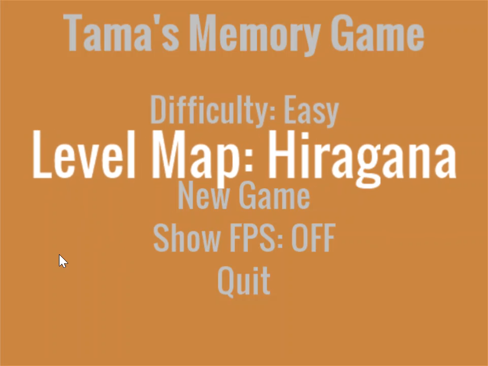
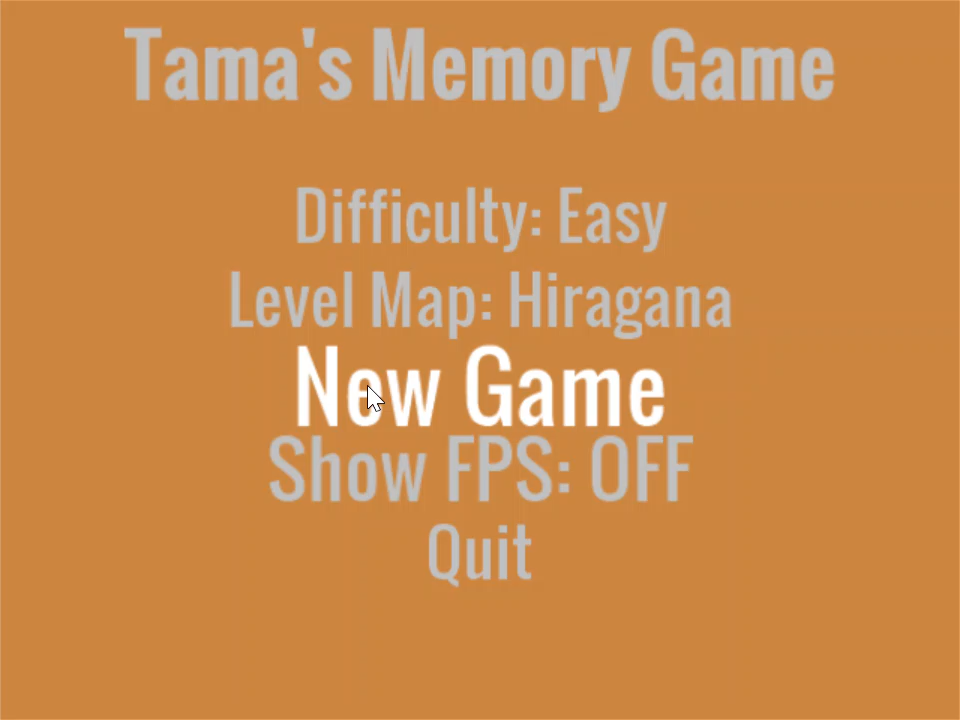
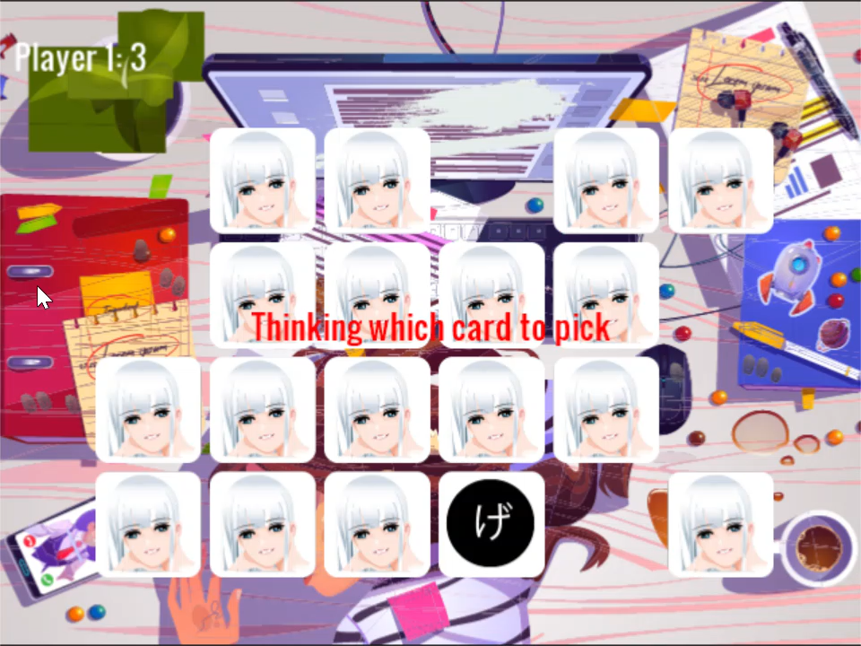

**Welcome** to Tama's Memory Game - Japanese edition.
A vehicle for evaluating Pyhon for gaming.

**Click** the image below to see a playthrough.

 

In this game, you play against an AI (very limited) in three different modes.
**[Easy, Normal, Hard]** - Hard mode is very unforgiving.

The player with the highest score (number of matches) is the winner.

# How To Play

When menu options have multiple choices available, click until the option you
want appears.  The option will recycle to the begining of the list once the end
has been reached.  

For keyboard and analog stick players, use the right or left to navigate
between the different choices.  Pressing up and down will navigate between the
different menus.

## Select a Difficulty Level

Choose between three difficulty levels:

* **Easy** - The AI randomly chooses between all the available cards. 
* **Medium** - The AI memorizes the last three moves.
* **Hard** - The AI memorizes every move since the game began.

## Select a Level Map

Currently there are only two available level maps, Katakana and Hiragana.  There are future plans to add numbers
and date/time.

## Start the Game

Press **New Game** to start game play.

## Make a Match

Match the English sound with the corresponding Japanese character.  

Once two cards have been flipped by the Player, click anywhere on the screen to
continue.  

Note: Some characters will have the same English sounds.  In these situations, hints
will be displayed on the card prompting the Player with the correct match.

## AI Player's Turn

When you see the message **Thinking which card to pick**, it is the AI's turn.
The AI will choose two cards with a brief pause before flipping the cards back
over.  

## Game Over

The game is over when all cards have been flipped.  

I hope you enjoyed the
game.  It's intended to compliment a proper foreign langugage course by
assisting with memory retention.
